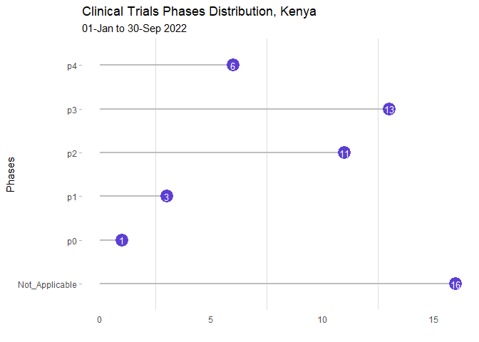

Clinical Trials Part 1
================
David Andai
10/28/2022

A well-functioning health system ensures equitable access to essential
medical products, vaccines and technologies of assured quality, safety,
efficacy and cost-effectiveness, and their scientifically sound and
cost-effective use. (WHO building blocks) The noble SARS covid 19 virus,
had pharmaceutical companies in a foot race to discover a vaccine that
was safe for everyone. The efficacy of the vaccine and it being safe to
use across all populations became a question that arose. With the global
north leading in vaccine production, this possed the question of where
does Africa stand in the space of drug discovery and clinical trials.

(image)

Clinical Trials Clinical trials are conducted to collect data regarding
the safety and efficacy of new drug and device development. This paves
way for drugs in manufacturing to benefit the population at hand.
Clinical trials are an essential part of drug development. In Kenya for
example, The Pharmacy and Poisons Board will approve protocols for
clinical trials for new drugs and established guidelines for clinical
trials involving drugs already registered in Kenya. Clinical trials are
distributed into Phases. Phases Kenya has had the capacity to register
according to the data repository at clinical trials.org The studies are
in the following phases. \* Phase I studies assess the safety of a drug
or device. usually includes a small number of healthy volunteers (20 to
100) who are generally paid for participating in the study. \* Phase II
studies test the efficacy of a drug or device. Most phase II studies are
randomized trials. \* Phase III studies involve randomized and blind
testing in several hundred to several thousand patients. 70% to 90% of
drugs that enter Phase III studies successfully complete this phase of
testing. \* Phase IV studies, often called postmarketing surveillance
trials, are conducted after a drug or device has been approved for sale.
Pharmaceutical companies have several objectives at this stage: (1) to
compare a drug with other drugs already in the market (2) to monitor a
drug’s long-term effectiveness and impact on a patient’s quality of life
(3) to determine the cost-effectiveness of a drug therapy relative to
other traditional and new therapies.
(<https://www.centerwatch.com/blog>)

``` r
#Now, record each observation of phases into their own row
 plot1 <- ggplot(data = Phases_data1,
         aes(x =count_a , y =fix_Phase, label = round (count_a, 1)))+
    geom_point()+
    geom_segment(aes(y=fix_Phase, yend=fix_Phase, x=0, xend=count_a),
                 size = 1,
                 color = 'grey')+
    geom_point(
      size = 6,
      color = '#5D3FD3'
    )+
    geom_text(aes(label=count_a),color='white', size = 3.5)+
    theme_light()+
    theme (
      panel.grid.major = element_blank(),
      panel.border = element_blank(),
      axis.ticks.x = element_blank()
    )+
    xlab("")+
    ylab("Phases")+
    ggtitle("Clinical Trials Phases Distribution, Kenya")+
    labs (subtitle = '01-Jan to 30-Sep 2022')+
    scale_x_continuous(breaks = breaks_width(5))
```

``` r
plot1
```

<!-- -->
